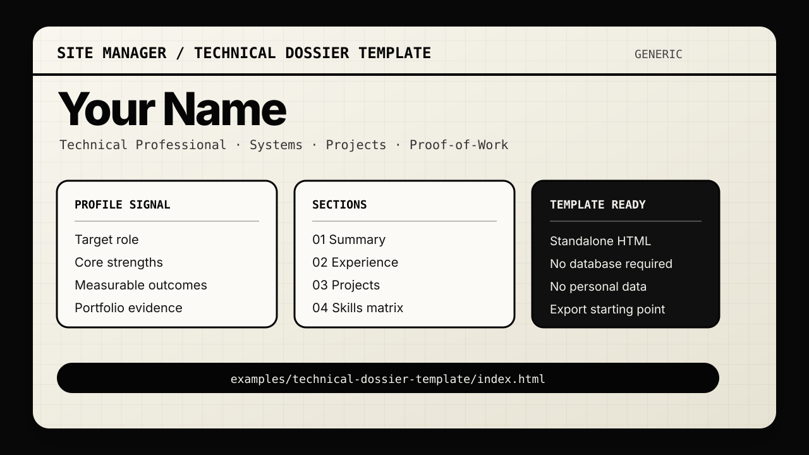

# Site Manager
[](https://github.com/Aedankerr/site-manager/actions/workflows/ci.yml)
[](LICENSE.txt)

This is a CV / Resume management system with an editable theme, persistent database storage, and Docker deployment ready for Unraid.

## Preview

<p>
  
</p>

Live GitHub Pages demo: <https://aedankerr.github.io/site-manager/>

## Features

- **Template/demo exports**: Includes a standalone generic technical dossier template under `examples/technical-dossier-template/` for theme/layout reference.
- **7 Sections**: About, Timeline (auto-generated), Experience, Certifications, Education, Skills, Projects
- **Custom Sections**: Add your own sections with different layout possibilities
- **Full CRUD**: Add, edit, delete any item
- **Visibility Toggles**: Hide items from PDF export while keeping them in database
- **Print/PDF Export**: Clean print styles, hidden items excluded
- **Import/Export**: Backup and restore your CV data as JSON - ideal to process the data via any LLM for optimization
- **Persistent Storage**: SQLite database survives container restarts
- **Multi CV**: Save different of your CV. Preview them and load them as need be
- **Responsive Design**: Works on desktop and mobile
- **Auto-Generated Timeline**: Timeline automatically builds from your experiences
- **ATS Optimized**: Schema.org markup, semantic HTML, hidden keywords for job site parsing
- **SEO Ready**: Dynamic robots.txt and sitemap.xml for the public site

## Static template/demo export

The repository includes a standalone static dossier template in [`examples/technical-dossier-template/`](examples/technical-dossier-template/). It is useful as a theme/layout reference or as a starting point for exported resume pages without replacing the main installable Site Manager app.

```bash
cd examples/technical-dossier-template
python3 -m http.server 8080
```

Then open `http://localhost:8080/index.html`.

## Quick Start (Docker)

### One-Line Install
``` bash
curl -fsSL https://raw.githubusercontent.com/Aedankerr/site-manager/main/install.sh | bash
```
Or download and run:

```bash
wget https://raw.githubusercontent.com/Aedankerr/site-manager/main/install.sh
chmod +x install.sh
./install.sh
```

### Manual Option 1: Docker Compose 

```bash
# Clone or copy the files
cd site-manager

# Create data directory
mkdir -p /mnt/user/appdata/site-manager/data/uploads

# Start the container
docker-compose up -d --build

# Access at:
# - http://localhost:3000 (Admin - full edit access)
# - http://localhost:3001 (Public - read-only)
```

### Manual Option 2: Docker Compose with Named Volume

Use `docker-compose.volume.yml` if you prefer Docker-managed volumes:
```bash
docker-compose -f docker-compose.volume.yml up -d --build
```

### Manual Option 3: Docker Run

```bash
# Build the image
docker build -t site-manager .

# Run with persistent data
docker run -d \
  --name site-manager \
  -p 3000:3000 \
  -p 3001:3001 \
  -v /mnt/user/appdata/site-manager/data:/app/data \
  --restart unless-stopped \
  site-manager
```

## Two Server Modes

| Port | Mode | Description |
|------|------|-------------|
| 3000 | Admin | Full edit access, toolbar, all controls |
| 3001 | Public | Read-only, no toolbar, no edit buttons, security hardened |

### Public Server Security Features (Port 3001)

- **GET-only**: All POST/PUT/DELETE requests blocked
- **Rate limiting**: 60 requests/minute per IP
- **Security headers**: X-Frame-Options, CSP, XSS protection
- **No sensitive data**: Email/phone not exposed in API
- **Visible items only**: Hidden items not returned by API
- **No IDs exposed**: Database IDs not included in responses
- **SEO files**: Dynamic robots.txt and sitemap.xml

### Cloudflare Tunnel Setup

Point your CF tunnel to port 3001 for public access:
```yaml
# In your cloudflared config
ingress:
  - hostname: cv.yourdomain.com
    service: http://site-manager:3001
```

The sitemap.xml and robots.txt are automatically generated with the correct domain based on the incoming request headers.

## Unraid Deployment

### Method 1: Install from Unraid Apps *(planned)*

Site Manager is intended to be installable from the Unraid **Apps** tab, but the Community Apps listing is not available yet.

Once it is listed:

1. In the Unraid **Apps** tab, search for **Site Manager**.
2. Install **Site Manager (Admin)** first.
3. Install **Site Manager (Public)** second if you want a separate read-only public container.
4. Use the same AppData and Uploads paths for both containers so they share the same database and images.

> Until the Community Apps listing is published, use Method 2 or the custom XML templates documented in [`docs/getting-started/unraid.md`](docs/getting-started/unraid.md).

### Method 2: Custom Unraid XML templates

The repository includes Community Apps-style template files under [`templates/`](templates/) plus a legacy direct-install mirror under [`unraid/`](unraid/):

- [`templates/site-manager.xml`](templates/site-manager.xml) — Admin template for Community Apps submission
- [`templates/site-manager-public.xml`](templates/site-manager-public.xml) — Public read-only template for Community Apps submission
- [`unraid/unraid-site-manager-admin.xml`](unraid/unraid-site-manager-admin.xml) — legacy direct-install mirror
- [`unraid/unraid-site-manager-public.xml`](unraid/unraid-site-manager-public.xml) — legacy direct-install mirror

Follow the detailed custom-template and Community Apps submission notes in [`docs/getting-started/unraid.md`](docs/getting-started/unraid.md).

### Method 3: Docker Compose Manager Plugin

1. Install the "Docker Compose Manager" plugin from Community Apps
2. Create a new stack with the `docker-compose.yml` content
3. Set the path for data persistence (e.g., `/mnt/user/appdata/site-manager/data`)
4. Start the stack


## Data Persistence

The SQLite database is stored in the `data` directory. Make sure to:

1. Mount `/app/data` to a persistent location on your host
2. Back up the `cv.db` file periodically
3. Use the Export feature for JSON backups

## Profile Picture

To add your profile picture:

1. Name your picture `picture.jpeg`
2. Place it in the `data/uploads/` folder:
   - Docker: `/app/data/uploads/picture.jpeg` (inside container)
   - Unraid bind mount: `/mnt/user/appdata/site-manager/data/uploads/picture.jpeg`
   - Docker volume: Use `docker cp picture.jpeg site-manager:/app/data/uploads/`

The picture will automatically display instead of initials. If no picture is found, initials are shown as fallback.

Supported format: JPEG (must be named `picture.jpeg`)

## API Endpoints

| Method | Endpoint | Description |
|--------|----------|-------------|
| GET | `/api/profile` | Get profile data |
| PUT | `/api/profile` | Update profile |
| GET | `/api/experiences` | List all experiences |
| POST | `/api/experiences` | Create experience |
| PUT | `/api/experiences/:id` | Update experience |
| DELETE | `/api/experiences/:id` | Delete experience |
| GET | `/api/certifications` | List certifications |
| POST | `/api/certifications` | Create certification |
| PUT | `/api/certifications/:id` | Update certification |
| DELETE | `/api/certifications/:id` | Delete certification |
| GET | `/api/education` | List education |
| POST | `/api/education` | Create education |
| PUT | `/api/education/:id` | Update education |
| DELETE | `/api/education/:id` | Delete education |
| GET | `/api/skills` | List skill categories |
| POST | `/api/skills` | Create skill category |
| PUT | `/api/skills/:id` | Update skill category |
| DELETE | `/api/skills/:id` | Delete skill category |
| GET | `/api/projects` | List projects |
| POST | `/api/projects` | Create project |
| PUT | `/api/projects/:id` | Update project |
| DELETE | `/api/projects/:id` | Delete project |
| GET | `/api/timeline` | Get auto-generated timeline |
| GET | `/api/sections` | Get section visibility |
| PUT | `/api/sections/:name` | Update section visibility |
| GET | `/api/cv` | Export all CV data |
| POST | `/api/import` | Import CV data |

## Importing Your Existing Data

Create a JSON file with your CV data and use the Import button, or POST to `/api/import`:

```json
{
  "profile": {
    "name": "Your Name",
    "initials": "YN",
    "title": "Your Title",
    "subtitle": "Your tagline",
    "bio": "Your bio...",
    "location": "City, Country",
    "linkedin": "https://linkedin.com/in/yourprofile",
    "languages": "English, French"
  },
  "experiences": [
    {
      "job_title": "Senior Developer",
      "company_name": "Company Inc",
      "start_date": "2020-01",
      "end_date": "",
      "location": "Remote",
      "country_code": "us",
      "highlights": ["Led team of 5", "Delivered project X"]
    }
  ],
  "certifications": [
    {
      "name": "AWS Solutions Architect",
      "provider": "Amazon",
      "issue_date": "Jan 2023"
    }
  ],
  "education": [
    {
      "degree_title": "MSc Computer Science",
      "institution_name": "University",
      "start_date": "2010",
      "end_date": "2014",
      "description": "Focus on AI"
    }
  ],
  "skills": [
    {
      "name": "Programming",
      "icon": "💻",
      "skills": ["JavaScript", "Python", "Go"]
    }
  ],
  "projects": [
    {
      "title": "Project Name",
      "description": "What it does",
      "technologies": ["React", "Node.js"]
    }
  ]
}
```

## Environment Variables

| Variable | Default | Description |
|----------|---------|-------------|
| `PORT` | `3000` | Server port |
| `PUBLIC_PORT` | `3001` | Server port Read only|
| `DB_PATH` | `./data/cv.db` | SQLite database path |

## Development

```bash
# Install dependencies
npm install

# Run in development mode (auto-reload)
npm run dev

# Run in production mode
npm start
```

## License

PolyForm Noncommercial 1.0.0 — free for personal and non-commercial use. Commercial use is not permitted. See [LICENSE.txt](LICENSE.txt) for details.
